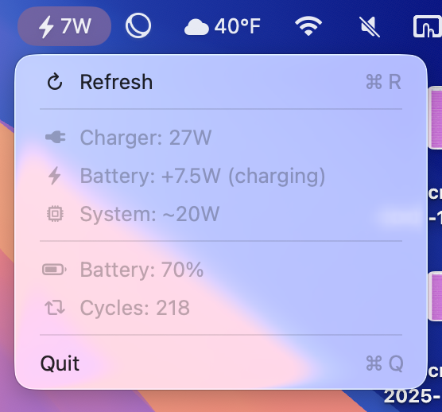

# PowerMonitor

I was on a flight that only had a USB power outlet, and I didn't know whether I was drawing more power than I was receiving. So I built this.



A single-file SwiftUI menu bar app for macOS. Event-driven via IOKit — near-zero CPU when idle.

## Install

```bash
git clone https://github.com/jlreyes/PowerMonitor.git
cd PowerMonitor
make install
open -a ~/.local/bin/PowerMonitor.app
```

## Auto-start on login

```bash
make launchd-install
```

To remove:

```bash
make launchd-uninstall
```

## How it works

- Registers an `IOPSNotificationCreateRunLoopSource` callback that fires on any power source change
- Reads `AppleSmartBattery` via IOKit for voltage, amperage, charging state
- If `ExternalConnected == true && InstantAmperage < 0` — you're draining while plugged in
- Sends a native macOS notification (5-min cooldown) when this happens

## Menu bar states

| Icon | Meaning |
|---|---|
| ⚡ 9W | Plugged in, charging at 9W into battery |
| ⚠ 5W | Plugged in, draining at 5W (charger can't keep up) |
| 63% | On battery |

## Requirements

- macOS 13+
- Swift 5.9+

## License

MIT
